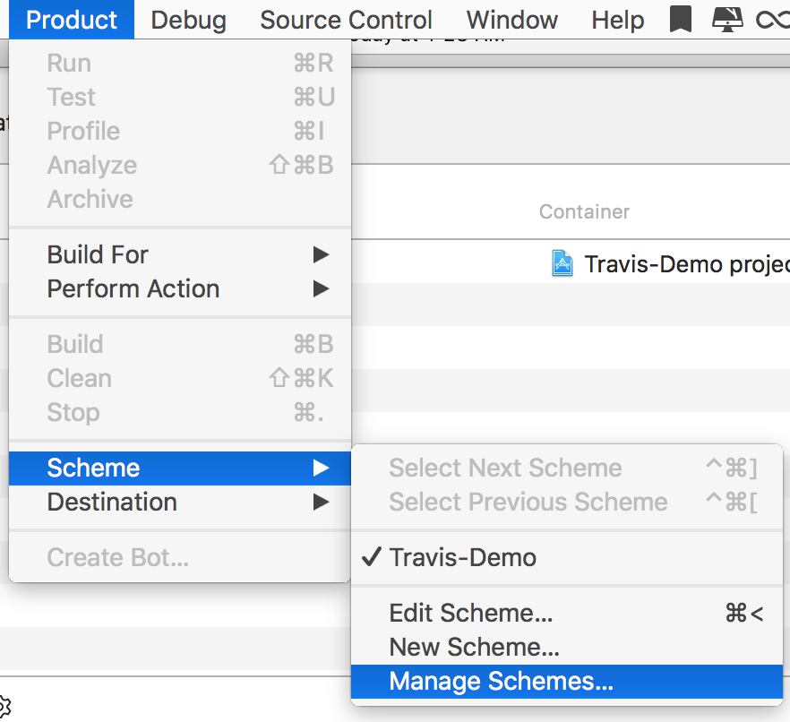
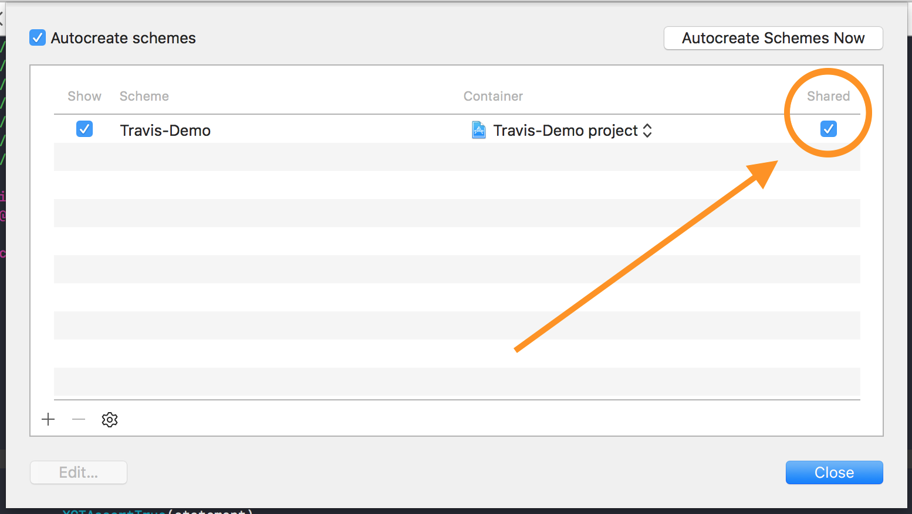
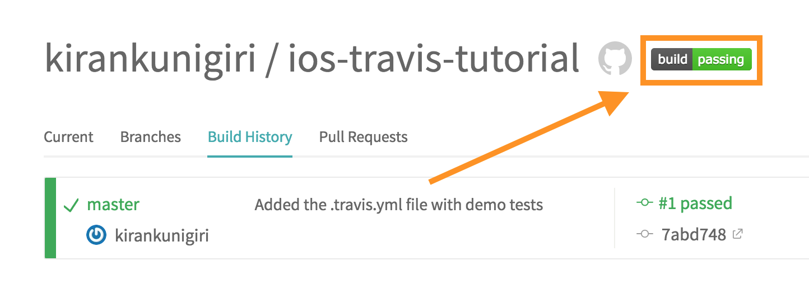
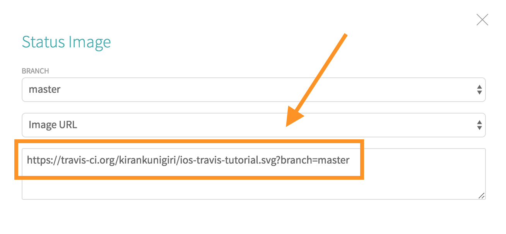

# iOS Travis CI Tutorial


## About
CI, or continuous integration, allows you to automatically check that your project builds successfully, and that all unit tests have passed every time you make a commit or someone else makes a pull request. Pretty handy.

## Let's get started
To get started, sign up for a free account at [travis.org](https://travis-ci.org). You'll be able to use this for unlimited public repositories. After your account syncs, go ahead and add the repo that you want to use Travis with.

### 1. Xcode Scheme Setting
First, we need to change one of the settings in our scheme. Navigate to Scheme → Manage Schemes



Next, make sure that the box is checked under "Shared".


And that's it for Xcode.

### 2. The .yml file
In the root directory of your repository, create a file named `.travis.yml` and open it up in a text editor. Then paste the following in to it.

```
language: objective-c
osx_image: xcode9

script:
  - xcodebuild test -project YOUR_PROJECT_DIRECTORY.xcodeproj -scheme YOUR_PROJECT_SCHEME -destination "platform=iOS Simulator,name=iPhone 7" -sdk iphonesimulator11.0 CODE_SIGNING_REQUIRED=NO
```

First, we specify the language. Type objective-c, even if you're using Swift. Next, we say that we want to run it on Xcode 9.

Finally, we run a script with xcodebuild with the test command using a bunch of parameters. We specify the destination (which simulator to use), the SDK to use, the project directory, and the scheme name.

Replace the words YOUR_PROJECT_DIRECTORY and YOUR_PROJECT_SCHEME with your own. For example, in this project, we ue use Travis-Demo/Travis-Demo.xcodeproj for the directory, and Travis-Demo as the scheme.

### 3. Commit and view the results
Make a commit! The results should show up on the Travis website. If your project didn't build, or any of the unit tests failed, travis will mark your build as failing. Otherwise, you're good to go and it'll say that it passed!

### 4. The fancy badge

There's a fancy badge that you've probably seen around on other popular repos. It automatically changes each time you commit to show the status of your build.

To add it, just go to your repo on the Travis site and click on the badge.



Then, a link will show up, and you can paste it into your README file in markdown format.


### And that's it!
##### Enjoy your amazing new life with continous integration!